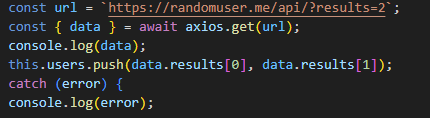
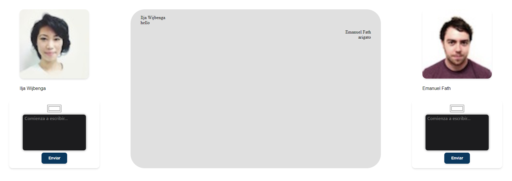

- [Desafio Consumo de Datos desde una Api Rest](#desafio-consumo-de-datos-desde-una-api-rest)
  - [Requerimientos](#requerimientos)
  - [Pasos](#pasos)
  - [Resultado](#resultado)

# Desafio Consumo de Datos desde una Api Rest

- Descripción

  Para poner a prueba tus conocimientos del consumo de API’s deberás realizar una mini aplicación con temática de chat para permitir el diálogo entre 2 desconocidos. Ambas personas deberán ser obtenidas a través de la API Random User.

  ---

## Requerimientos

1. Utilizar Axios para el consumo de datos de la API Random User.

2. Usar el ciclo de vida de los componentes para obtener la información de los usuarios al cargar la aplicación.

3. Utilizar los eventos para agregar las interacciones que permitan el registro de nuevos mensajes en el chat.

4. Hacer uso del style y/o class binding para el direccionamiento y el color de fondo de los mensajes según corresponda a su propietario. 
   

   ---

## Pasos

1. Utilizamos Axios para el consumo de datos de la API Random User.

2.  Usamos el ciclo de vida de los componentes para obtener la información de los usuarios al cargar la aplicación

3. Utilizamos los eventos para agregar las interacciones que permitan el registro de nuevos mensajes en el chat.
   
   
   

4. Hacemos uso del style y/o class binding para el direccionamiento y el color de fondo de los mensajes según corresponda a su propietario. 

 

 
---

## Resultado

